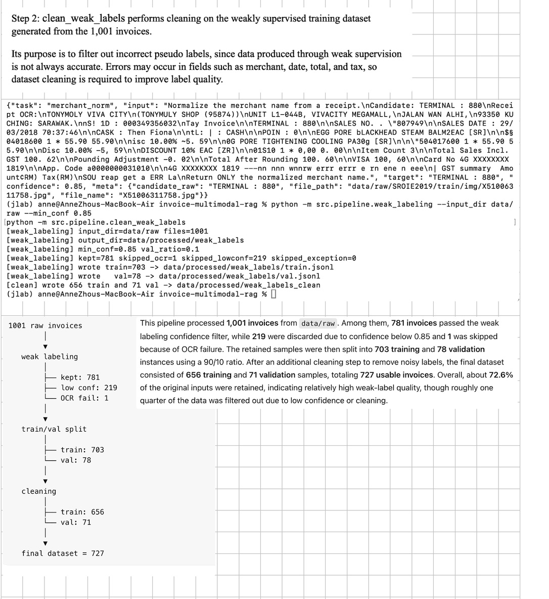
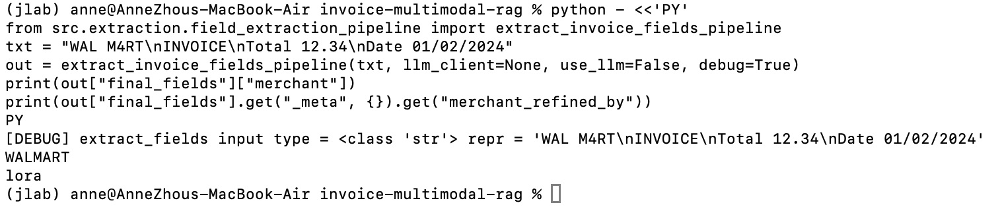
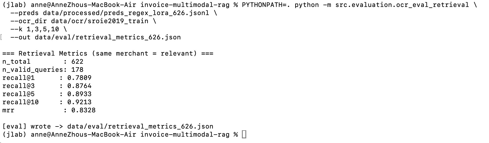
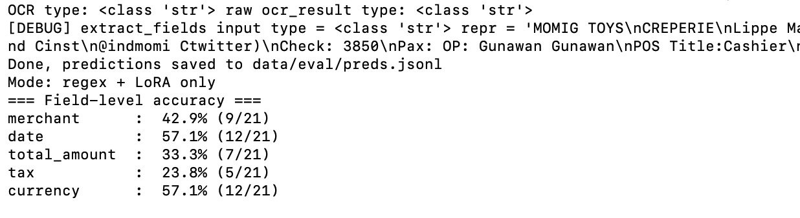
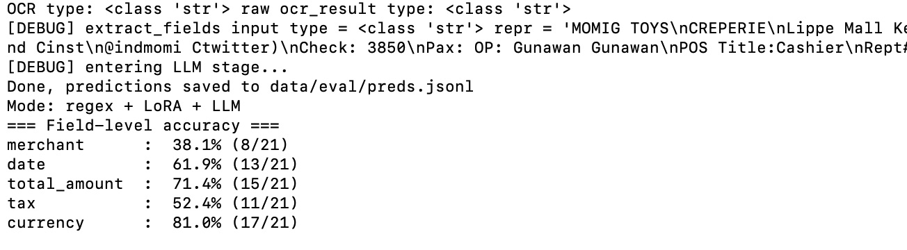
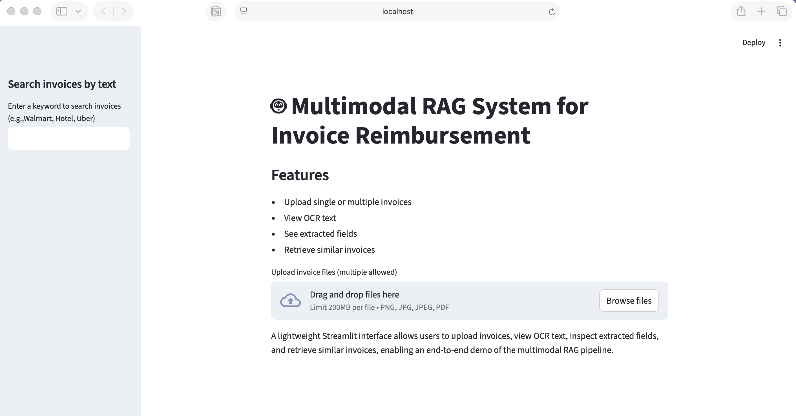
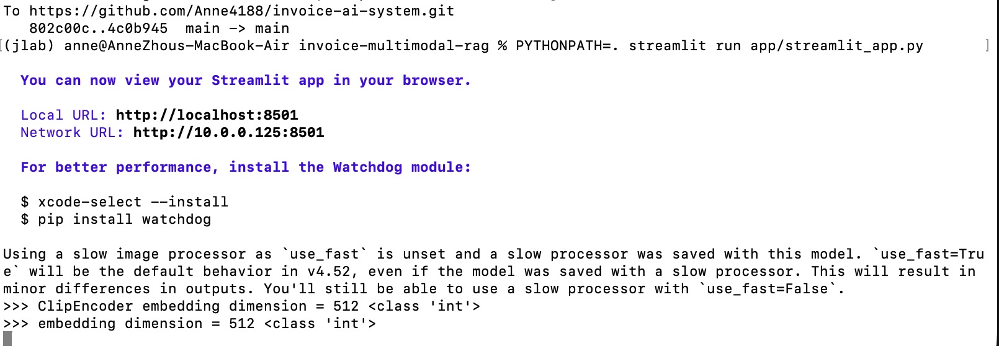
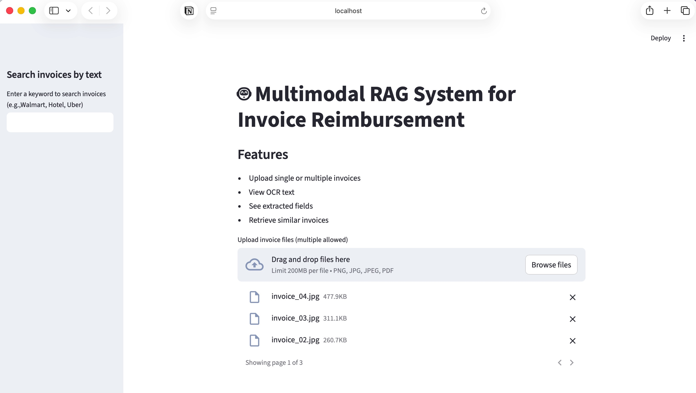
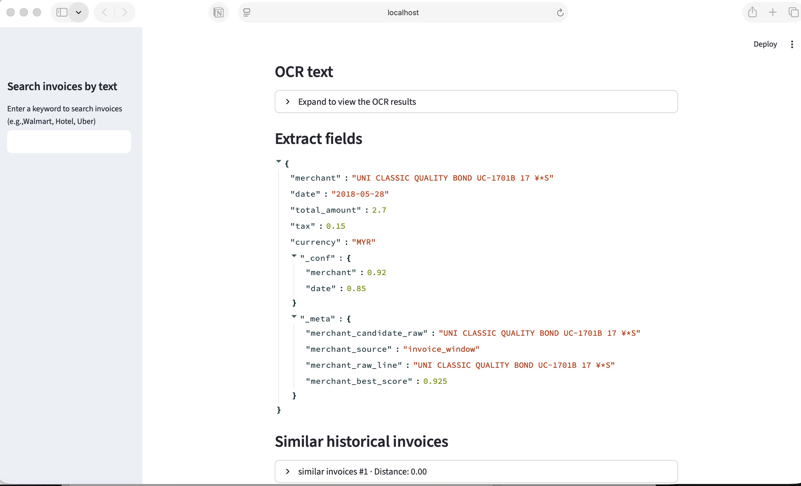

# Invoice AI System
End-to-End AI Pipeline for Intelligent Invoice Processing

This project implements a production-style AI pipeline for extracting structured information from invoices and retrieving similar invoices using multimodal embeddings.

The system combines rule-based extraction, confidence routing, LoRA fine-tuned models, optional LLM fallback, and vector retrieval to build a robust invoice understanding system.

---

# Key Features
• OCR-based invoice text extraction  
• Rule-based information extraction (merchant, date, total, tax)  
• Confidence-based routing system  
• LoRA fine-tuned merchant normalization model  
• Optional LLM semantic correction stage  
• CLIP embedding generation for multimodal retrieval  
• FAISS vector database for similar invoice search  
• Streamlit interactive demo interface  
• Evaluation framework for extraction and retrieval metrics  

---

# System Architecture

The system uses a layered architecture to balance accuracy, interpretability, and cost. An invoice image or PDF is first processed by OCR to obtain text. A rule-based extraction module then extracts key fields such as merchant, date, and total amount, and assigns confidence scores. If the merchant confidence is below a threshold, a LoRA fine-tuned normalization model is triggered to correct the merchant name; otherwise the regex result is used directly. An optional LLM stage can further refine fields using semantic reasoning. The structured invoice data is then encoded into embeddings using CLIP and stored in a FAISS vector database. Finally, similar invoices are retrieved and all results are displayed through the Streamlit interface, enabling an end-to-end intelligent invoice processing and retrieval system.

# Dataset
The system was tested on 626～1001 real-world invoice.
Dataset characteristics:
• noisy OCR text
• multiple merchant formats
• inconsistent invoice structures
• varying tax and currency formats

Weak supervision was used to generate training data for merchant normalization.

# Weak Supervision Pipeline
To build training data without manual labeling:

OCR text  
↓  
high-confidence regex extraction  
↓  
weak labels generation  
↓  
weak label cleaning  
↓  
LoRA fine-tuning dataset  

# LoRA Merchant Normalization
A LoRA fine-tuned model is used to correct merchant names when rule-based extraction has low confidence.
Example: 
OCR text:  
WAL M4RT

Regex output:  
merchant = "WAL M4RT"

LoRA correction:  
merchant = "WALMART"

The model only runs when: merchant_conf < threshold
This design reduces inference cost and preserves rule-based interpretability.

# Retrieval System
To support invoice similarity search:

OCR text
↓
CLIP embedding
↓
FAISS vector index
↓
Top-K similar invoices

Retrieval relevance is defined as invoices from the same merchant.

# Evaluation Metrics
• merchant accuracy
• date accuracy
• total amount accuracy
• tax accuracy

Retrieval Metrics
Metric	          Description
Recall@K	      probability that a relevant invoice appears in top-K
MRR	Mean          Reciprocal Rank

Example result (1001 invoices):
Recall@1  = 0.78  
Recall@3  = 0.87  
Recall@5  = 0.89  
Recall@10 = 0.92  
MRR       = 0.83  

# Running the System
1 Activate environment：

cd invoice-multimodal-rag
source ~/jlab/bin/activate

2 Run extraction pipeline：

PYTHONPATH=. python scripts/run_pipeline_on_ocr.py \
  --ocr_dir data/ocr/sroie2019_train \
  --out data/processed/preds_regex_lora.jsonl

3 Run evaluation：

python -m src.evaluation.run_eval_predictions
python -m src.evaluation.eval_metrics

4 Retrieval evaluation：

PYTHONPATH=. python -m src.evaluation.ocr_eval_retrieval \
  --preds data/processed/preds_regex_lora_626.jsonl \
  --ocr_dir data/ocr/sroie2019_train

5 Launch demo UI

streamlit run app/streamlit_app.py

# Project Structure

                    ┌──────────────────────────────┐
                    │      Streamlit Demo UI       │
                    │ upload / display / search    │
                    └──────────────┬───────────────┘
                                   │
                      user uploads invoice / query
                                   │
                                   ▼
                    ┌──────────────────────────────┐
                    │       Invoice Image/PDF      │
                    └──────────────┬───────────────┘
                                   │
                                   ▼
                    ┌──────────────────────────────┐
                    │             OCR              │
                    │   Tesseract / pdf2image      │
                    └──────────────┬───────────────┘
                                   │
                                   ▼
                    ┌──────────────────────────────┐
                    │     Rule-based Extraction    │
                    │ merchant/date/total/tax      │
                    └──────────────┬───────────────┘
                                   │
                                   ▼
                    ┌──────────────────────────────┐
                    │      Confidence Scoring      │
                    │        merchant_conf         │
                    └──────────────┬───────────────┘
                                   │
                      merchant_conf < threshold ?
                           ┌────────┴────────┐
                           │                 │
                          YES                NO
                           │                 │
                           ▼                 ▼
                ┌──────────────────┐   ┌──────────────────┐
                │  LoRA Normalizer │   │ Use regex output │
                │ merchant refine  │   │ directly         │
                └────────┬─────────┘   └────────┬─────────┘
                         │                      │
                         └──────────┬───────────┘
                                    │
                                    ▼
                    ┌──────────────────────────────┐
                    │     Optional LLM Fallback    │
                    │   semantic correction stage  │
                    └──────────────┬───────────────┘
                                   │
                                   ▼
                    ┌──────────────────────────────┐
                    │     Structured Invoice Data  │
                    │ merchant/date/total/tax/etc  │
                    └──────────────┬───────────────┘
                                   │
                    ┌──────────────┴───────────────┐
                    │                              │
                    ▼                              ▼
      ┌──────────────────────────┐    ┌──────────────────────────┐
      │   Evaluation / Metrics   │    │   Embedding Generation   │
      │ field acc / routing /    │    │ text/image representation│
      │ Recall@K / MRR           │    └──────────────┬───────────┘
      └──────────────────────────┘                   │
                                                     ▼
                                      ┌──────────────────────────┐
                                      │     Vector Store         │
                                      │        FAISS             │
                                      └──────────────┬───────────┘
                                                     │
                                                     ▼
                                      ┌──────────────────────────┐
                                      │ Similar Invoice Retrieval│
                                      │ duplicate / same merchant│
                                      └──────────────┬───────────┘
                                                     │
                                                     ▼
                                      ┌──────────────────────────┐
                                      │ Returned to Streamlit UI │
                                      │ OCR / fields / retrieval │
                                      └──────────────────────────┘

I worked on was a cost-aware invoice intelligence system for noisy real-world
invoices. I built an OCR pipeline that handled images and PDFs with preprocessing steps such as
scaling, grayscale conversion, and binarization before running Tesseract extraction. I then
implemented rule-based field extraction and a confidence-based routing layer that decided
whether to use rule outputs directly, refine them using a LoRA-tuned FLAN-T5 model, or fall
back to a stronger LLM. I also added a FAISS-based retrieval layer and evaluated it on 626 ~ 1001 real
invoices, achieving Recall@1 of 0.78 and MRR of 0.83. This project helped me understand how
to design modular pipelines, evaluate retrieval quality, and balance cost with accuracy.

# Key Design Ideas
This system follows a layered decision architecture.

1）test regex + LoRA only:

2）test regex+LoRA+LLM

Rules → LoRA → LLM
This provides:
• low inference cost
• better interpretability
• scalable architecture

To reduce cost, my pipeline is not designed to send every invoice directly to a large LLM. Instead, it follows a layered decision strategy. It first performs regex-based extraction, then applies LoRA-based refinement for low-confidence cases, and only optionally escalates to a stronger LLM as a fallback. During evaluation, I compare two configurations: regex + LoRA only and regex + LoRA + LLM, allowing me to measure both the quality improvement and the cost trade-off.

# Demo

instead of relying on a single large model.
The Streamlit interface allows users to:

• allow upload multiple invoice images
• view OCR text
• see extracted fields
• retrieve similar invoices

# Future Improvements

• Layout-aware document models
• Better multilingual OCR
• Improved tax extraction
• Merchant knowledge graph
• Larger fine-tuning dataset

